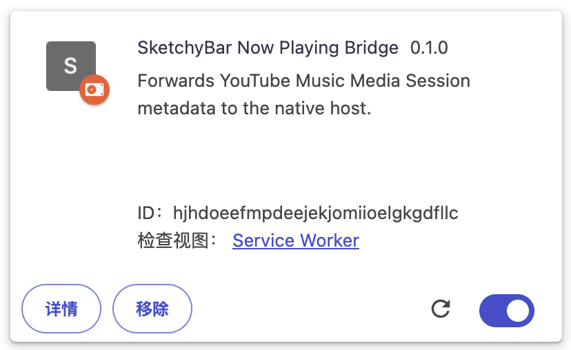

# sketchybar configuration

My sketchybar configuration files. I use sketchybar because when "Displays have separate Spaces" is disabled, macOS shows the menu bar only on the primary display; sketchybar provides a consistent, customizable status bar across displays.


The present config for sketchybar is done entirely in lua (and some C), using [SbarLua](https://github.com/FelixKratz/SbarLua).
One-line install for sketchybar config (requires brew to be installed):
```bash
curl -L https://raw.githubusercontent.com/binbinsh/sketchybar-config/main/install_sketchybar.sh | sh
```

## Widgets & Integrations

- **Front App** (`items/front_app.lua`)
  - Shows the currently active app name.
  - Click: toggles `menus`/`spaces` via the `swap_menus_and_spaces` event.

- **LM Studio** (`items/widgets/lm_studio.lua`)
  - Hover: tints the icon.
  - Left-click: opens a popup listing installed models (from `lms ls`); click a row to load/start that model; the last row unloads all models.
  - Right-click: opens the LM Studio app.

- **Clipboard** (`items/widgets/clipboard.lua`)
  - Hover: tints the icon.
  - Left-click: opens Raycast Clipboard History.
  - Right-click: opens Raycast Ask Clipboard.
  - Requires Raycast Clipboard History extension (no fallback app).

- **Dictionary** (`items/widgets/dictionary.lua`)
  - Hover: tints the icon.
  - Left-click: Instant Translate the selected text.
  - Right-click: opens Raycast Quick Translate.
  - Requires Raycast Translate extension (`gebeto/translate`).

- **Volume** (`items/widgets/volume.lua`)
  - Shows current output volume and an icon.
  - Click: opens the SoundSource interface
  - Right-click: opens Sound preferences.

- **Quantumult X** (`items/widgets/quantumultx.lua`)
  - Hover: tints the icon.
  - Left-click: toggles a popup with Public IP, Location, and ISP (fetched from `ipinfo.io`).
  - Right-click: opens the Quantumult X app.

- **1Password** (`items/widgets/onepassword.lua`)
  - Hover: tints the icon.
  - Left-click: opens 1Password Quick Access (Cmd+Shift+Space).
  - Right-click: opens the 1Password app.

- **WeChat** (`items/widgets/wechat.lua`)
  - Shows unread count via the Dock badge.
  - Click: opens/activates WeChat.

- **iStat Menus** (`items/widgets/istat_menus.lua`)
  - Automatically aliases the Combined menu extra when present and groups it in a bracket.
  - Click: opens Activity Monitor.

- **Time Machine** (`items/widgets/time_machine.lua`)
  - Minimal widget with a popup listing the last 1–3 backup timestamps.
  - Left-click: shows a popup with the last 1–3 backups.
  - Right-click: opens the Time Machine app.

- **Synergy** (`items/widgets/synergy.lua`)
  - Hover: icon becomes colored; idle: grayscale.
  - Left-click: toggles a popup and fetches current status on demand.
  - Right-click: opens the Synergy app and brings its window to the front.
  - See the grayscale icon setup in [Synergy Icon (Grayscale Idle; Colored on Hover)](#synergy-icon-grayscale-idle-colored-on-hover).

- **Weather** (`items/widgets/weather.lua`)
  - Uses OpenWeather One Call API 3.0 for current weather conditions.
  - Retrieves API key from macOS Keychain: service `OPENWEATHERMAP_API_KEY` for account `$USER`.
  - Left-click: toggle popup with centered title “📍 `<place>` (lat, lon)  ↻”; click the title to refresh now.
  - Right-click: open OpenWeather map for your coordinates (fallback to the macOS Weather app).
  - Shows: Condition, Temperature, Feels like, Humidity, Wind, Pressure, Time zone, Sunrise, Sunset.
  - Auto-refreshes hourly; coordinates are acquired via a notarized helper app and reverse-geocoded via OpenStreetMap Nominatim.

- **Now Playing** (`items/widgets/now_playing.lua`)
  - Displays currently playing track metadata (title, artist, album).
  - Supports **Apple Music**, **Spotify**, and **YouTube Music** (via custom browser extension).
  - For YouTube Music support in Chrome, see [Optional setup#YouTube Music Bridge (Chrome/Brave Extension)](#optional-setup).


## Optional setup

- **LM Studio CLI**
  - Install with `~/.lmstudio/bin/lms bootstrap` (or ensure `lms` is on your PATH). The popup provides an install hint if missing.

- **Raycast (for Clipboard and Dictionary)**
  - Clipboard requires the Raycast Clipboard History extension; there is no fallback.
  - Dictionary requires the “Translate” extension (`gebeto/translate`); there is no fallback.

- **iStat Menus**
  - Enable the “Combined” menu extra so it can be aliased into the bar.

- **Time Machine**
  - Uses `tmutil` (bundled with macOS) to read last backup/snapshot times.

- **Quantumult X**
  - Uses `curl` to query plain-text `ipinfo.io` endpoints for IP/location/ISP.

- **WeChat**
  - Requires the macOS WeChat app to be installed (`com.tencent.xinWeChat`).
  - Recommended: enable App Icon Badges in System Settings → Notifications → WeChat.
  - Recommended: allow “osascript” in System Settings → Privacy & Security → Accessibility.

- **Synergy icons**
  - Follow the grayscale conversion steps in [Synergy Icon (Grayscale Idle; Colored on Hover)](#synergy-icon-grayscale-idle-colored-on-hover).

- **OpenWeather API Key**
  - Register a free API key from https://openweathermap.org/api (1,000 free calls/day)
  - Store key in Keychain once:
    ```bash
    security add-generic-password -a "$USER" -s OPENWEATHERMAP_API_KEY -w '<YOUR_API_KEY>' -U
    ```
  - The widget reads it with:
    ```bash
    security find-generic-password -a "$USER" -s OPENWEATHERMAP_API_KEY -w
    ```
  - Note: After registration, wait 1–2 hours for the API key to become active.

- **YouTube Music Bridge (Chrome/Brave Extension)**
  - Load the unpacked extension from `helpers/event_providers/now_playing/extension/`:
    - Open `chrome://extensions`, enable Developer mode, click "Load unpacked" → select the extension folder.
    - Copy the Extension ID shown on the extension card (see screenshot below).
  - Install the native messaging host:
    ```bash
    helpers/event_providers/now_playing/extension/install_bridge.sh --ext-id <EXTENSION_ID>
    ```
    This writes `~/Library/Application Support/Google/Chrome/NativeMessagingHosts/com.sketchybar.nowplaying.json` pointing to `~/.config/sketchybar/helpers/event_providers/now_playing/bin/now_playing` and whitelists your extension ID.
  - Restart the browser (`chrome://restart` or `brave://restart`), then play/pause on `https://music.youtube.com` to validate.
  - Screenshot showing the Extension ID:
    
    

## `now_playing` Event Provider

- What it is: a helper binary at `helpers/event_providers/now_playing/bin/now_playing` that bridges browser media playback (via Native Messaging) and Apple Music control (via AppleScript) to SketchyBar.
- Why: display real-time track metadata from YouTube Music (Chrome/Brave) and control Apple Music playback directly from the bar.
- How it works:
  - **Native Messaging mode**: When invoked by the browser extension, it receives track metadata (title, artist, album, state, elapsed, duration) and triggers the SketchyBar event `media_nowplaying`.
- **Standalone mode**: When run with an argument (`previous|next|toggle|playpause`), it first tries to control YouTube Music tabs in Chrome/Brave (injecting JS to click play/pause/next/prev), then falls back to controlling Apple Music via AppleScript.
- Permissions:
  - No special permissions required for Native Messaging.
  - Apple Music control requires the Music app to be installed and accessible via AppleScript.
- Troubleshooting:
  - If the extension cannot connect, verify the native host manifest is installed correctly (see installation steps above).
  - Check the extension's Service Worker console for connection errors.
  - Ensure the binary is executable: `chmod +x ~/.config/sketchybar/helpers/event_providers/now_playing/bin/now_playing`.

## SketchyBar Location Helper

- What it is: a tiny, bundled app at `helpers/event_providers/location/bin/SketchyBarLocationHelper.app` that gets your current coordinates via Core Location and writes them to a cache file read by the Weather widget.
- Why: avoid external dependencies and get user-approved location with proper macOS prompts.
- How it works:
  - On demand, `items/widgets/weather.lua` runs:
    - `open -W ~/.config/sketchybar/helpers/event_providers/location/bin/SketchyBarLocationHelper.app`
  - The helper requests When-In-Use authorization (first run shows a system prompt) and fetches one-shot location.
  - It writes a cache line to `~/.cache/sketchybar/location.txt` in the format: `ts|lat|lon|label` (the label is filled later by reverse geocoding).
  - The weather widget reads the coordinates, reverse-geocodes a human-friendly place name via OpenStreetMap, caches it, then queries OpenWeather.
- Permissions:
  - First run will show a Location Services prompt for “SketchyBar Location Helper”. Approve “While Using the App”.
  - You can manage this under System Settings → Privacy & Security → Location Services.
- Troubleshooting:
  - If it times out (~15s) or shows “⚠️LOC” on the bar, re-run the weather widget or check Location Services are enabled.
  - Delete caches and retry: `rm -f ~/.cache/sketchybar/location.txt ~/.cache/sketchybar/weather.txt`.

## Space snapshot scan without yabai

- What it is: a tiny C helper at `helpers/event_providers/space_scan/space_scan.c` that scans the currently active Space for on-screen app windows and publishes a `space_snapshot` event consumed by `items/spaces.lua` to render per-space app icons.
- Why: ensure the Space indicator shows correct icons at bar startup and after Space switches, without relying on yabai.
- How it works:
  - Enumerates on-screen windows via CoreGraphics (layer 0 only) and counts them per owning app.
  - Uses private SkyLight entry points to determine the current Space index on the main display.
  - Emits a SketchyBar event:
    - event name: `space_snapshot`
    - payload: `space='<index>' apps='AppA:2|AppB:1|…'`
  - `items/spaces.lua` subscribes to `space_snapshot` and updates the label of the corresponding `space.<index>` item immediately.
- When it runs:
  - Automatically on bar startup and on every `space_change` (wired in `items/spaces.lua`).
  - Can also be invoked manually:

```bash
$CONFIG_DIR/helpers/event_providers/space_scan/bin/space_scan
```

- Build/install: compiled automatically by `helpers/makefile` when SketchyBar starts (see `helpers/init.lua`).
- Limitations:
  - Uses SkyLight (private) APIs; behavior may change across macOS releases.
  - Scans the active Space only; other Spaces are initialized to “ —” until you switch to them. If you need all Spaces populated at once, extend the helper to map windows to all Spaces before emitting events.

## Synergy Icon (Grayscale Idle; Colored on Hover)

`items/widgets/synergy.lua` expects a grayscale icon at `~/.config/sketchybar/icons/synergy_gray.png`.
Create it once from your color icon using macOS `sips`:

```bash
mkdir -p ~/.config/sketchybar/icons
sips --matchTo \
"/System/Library/ColorSync/Profiles/Generic Gray Gamma 2.2 Profile.icc" \
~/.config/sketchybar/icons/synergy.png \
--out ~/.config/sketchybar/icons/synergy_gray.png
```
