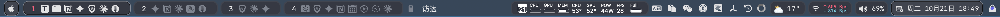

# sketchybar configuration

My sketchybar configuration files. I use sketchybar because when "Displays have separate Spaces" is disabled, macOS shows the menu bar only on the primary display; sketchybar provides a consistent, customizable status bar across displays.



The present config for sketchybar is done entirely in lua (and some C), using [SbarLua](https://github.com/FelixKratz/SbarLua).
One-line install for sketchybar config (requires brew to be installed):
```bash
curl -L https://raw.githubusercontent.com/binbinsh/sketchybar-config/main/install_sketchybar.sh | sh
```

Widgets & Integrations
----------------------

- **Front App** (`items/front_app.lua`)
  - Shows the currently active app name.
  - Click: toggles `menus`/`spaces` via the `swap_menus_and_spaces` event.

- **LM Studio** (`items/widgets/lm_studio.lua`)
  - Hover: tints the icon.
  - Left-click: opens a popup listing installed models (from `lms ls`); click a row to load/start that model; the last row unloads all models.
  - Right-click: opens the LM Studio app.

- **Clipboard** (`items/widgets/clipboard.lua`)
  - Hover: tints the icon.
  - Left-click: opens Raycast Clipboard History.
  - Right-click: opens Raycast Ask Clipboard.
  - Requires Raycast Clipboard History extension (no fallback app).

- **Dictionary** (`items/widgets/dictionary.lua`)
  - Hover: tints the icon.
  - Left-click: Instant Translate the selected text.
  - Right-click: opens Raycast Quick Translate.
  - Requires Raycast Translate extension (`gebeto/translate`).

- **Volume** (`items/widgets/volume.lua`)
  - Shows current output volume and an icon.
  - Click: opens the SoundSource interface
  - Right-click: opens Sound preferences.

- **Quantumult X** (`items/widgets/quantumultx.lua`)
  - Hover: tints the icon.
  - Left-click: toggles a popup with Public IP, Location, and ISP (fetched from `ipinfo.io`).
  - Right-click: opens the Quantumult X app.

- **1Password** (`items/widgets/onepassword.lua`)
  - Hover: tints the icon.
  - Left-click: opens 1Password Quick Access (Cmd+Shift+Space).
  - Right-click: opens the 1Password app.

- **WeChat** (`items/widgets/wechat.lua`)
  - Shows unread count via the Dock badge.
  - Click: opens/activates WeChat.

- **iStat Menus** (`items/widgets/istat_menus.lua`)
  - Automatically aliases the Combined menu extra when present and groups it in a bracket.
  - Click: opens Activity Monitor.

- **Time Machine** (`items/widgets/time_machine.lua`)
  - Minimal widget with a popup listing the last 1–3 backup timestamps.
  - Left-click: shows a popup with the last 1–3 backups.
  - Right-click: opens the Time Machine app.

- **Synergy** (`items/widgets/synergy.lua`)
  - Hover: icon becomes colored; idle: grayscale.
  - Left-click: toggles a popup and fetches current status on demand.
  - Right-click: opens the Synergy app and brings its window to the front.
  - See the grayscale icon setup in [Synergy Icon (Grayscale Idle; Colored on Hover)](#synergy-icon-grayscale-idle-colored-on-hover).

- **Weather** (`items/widgets/weather.lua`)
  - Uses OpenWeather One Call API 3.0 for current weather conditions.
  - Retrieves API key from macOS Keychain: service `OPENWEATHERMAP_API_KEY` for account `$USER`.
  - Left-click: toggle popup with location, temp/feels-like, description, humidity, wind, pressure.
  - Right-click: open OpenWeather map for your coordinates (fallback to the macOS Weather app if unavailable).
  - Polls every 5 minutes per docs; local 5-minute cache to avoid 429 and reduce cost.
  - Location: uses a native CoreLocation helper (`helpers/event_providers/location/bin/location`). On first run macOS will prompt for permission.

Optional setup
--------------

- **LM Studio CLI**
  - Install with `~/.lmstudio/bin/lms bootstrap` (or ensure `lms` is on your PATH). The popup provides an install hint if missing.

- **Raycast (for Clipboard and Dictionary)**
  - Clipboard requires the Raycast Clipboard History extension; there is no fallback.
  - Dictionary requires the “Translate” extension (`gebeto/translate`); there is no fallback.

- **iStat Menus**
  - Enable the “Combined” menu extra so it can be aliased into the bar.

- **Time Machine**
  - Uses `tmutil` (bundled with macOS) to read last backup/snapshot times.

- **Quantumult X**
  - Uses `curl` to query plain-text `ipinfo.io` endpoints for IP/location/ISP.

- **WeChat**
  - Requires the macOS WeChat app to be installed (`com.tencent.xinWeChat`).
  - Recommended: enable App Icon Badges in System Settings → Notifications → WeChat.
  - Recommended: allow “osascript” in System Settings → Privacy & Security → Accessibility.

- **Synergy icons**
  - Follow the grayscale conversion steps in [Synergy Icon (Grayscale Idle; Colored on Hover)](#synergy-icon-grayscale-idle-colored-on-hover).

- **OpenWeather API Key**
  - Register a free API key from https://openweathermap.org/api (1,000 free calls/day)
  - Store key in Keychain once:
    ```bash
    security add-generic-password -a "$USER" -s OPENWEATHERMAP_API_KEY -w '<YOUR_API_KEY>' -U
    ```
  - The widget reads it with:
    ```bash
    security find-generic-password -a "$USER" -s OPENWEATHERMAP_API_KEY -w
    ```
  - Note: After registration, wait 1–2 hours for the API key to become active.

Synergy Icon (Grayscale Idle; Colored on Hover)
----------------------
`items/widgets/synergy.lua` expects a grayscale icon at `~/.config/sketchybar/icons/synergy_gray.png`.
Create it once from your color icon using macOS `sips`:

```bash
mkdir -p ~/.config/sketchybar/icons
sips --matchTo \
"/System/Library/ColorSync/Profiles/Generic Gray Gamma 2.2 Profile.icc" \
~/.config/sketchybar/icons/synergy.png \
--out ~/.config/sketchybar/icons/synergy_gray.png
```
